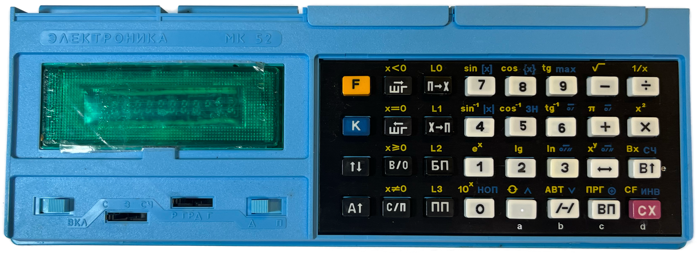

# Elektronika MK-52 Calculator
The Электроника МК-52 (МикроКалькулятор, Micro Calculator) was an advanced Soviet programmable calculator that had 512 bytes of permanent, erasable memory (via a КР1601РР1 EEPROM) and could be expanded with additional library functions via ROM cartridges:

- РПП-1: Games & entertainment (30-40 games)
- РПП-2: Financial & economic library
- БРП-3: Mathematical library
- БРП-4: Aerospace & navigation library
- БРП-5: Engineering & construction library

РПП = Расширитель Постоянной Памяти (permanent memory expansion) 
БРП = Блок Расширения Памяти (memory expansion block) 

The БРП-4 and БРП-5 were produced in large numbers and are pretty easy to find.  The earlier ones are quite rare.

They have a pretty terrible keypad - I have attempted to design a [replacement](/Elektronika_MK52_Keypad). 

Thanks to Alex J. Lowry for his design files that confirmed the physical dimensions and grid for the keys. 

